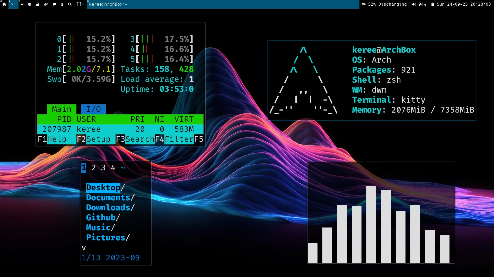

This is my personal fork of [suckless dwm](https://dwm.suckless.org), configured with a few custom patches and workflow optimizations. Feel free to use or adapt it for your own minimalist Linux setup.

## 📦 Dependencies

Make sure the following packages are installed:

```bash
xorg-server xorg-xinit libxft libxinerama kitty picom nitrogen xautolock xrandr unclutter
```

🚀 Installation
```bash
cd /usr/local
sudo git clone https://github.com/unikeree/dwm
cd dwm
sudo make clean install
```
Also, you need to install **dmenu** and **slock** separately, as they are required for launching applications and locking the screen, respectively.

Then:

Copy .xinitrc and .Xresources to your home directory:

```bash
cp .xinitrc ~/.xinitrc
cp .Xresources ~/.Xresources
```

Edit .xinitrc and set the path to your dwm-bar or status script if needed.

Launch your environment:

```bash
startx
```

⚙️ Notes

    This configuration is aimed at minimalism and speed.

    Includes support for keyboard shortcuts, autostart apps, and custom status bar scripts.
